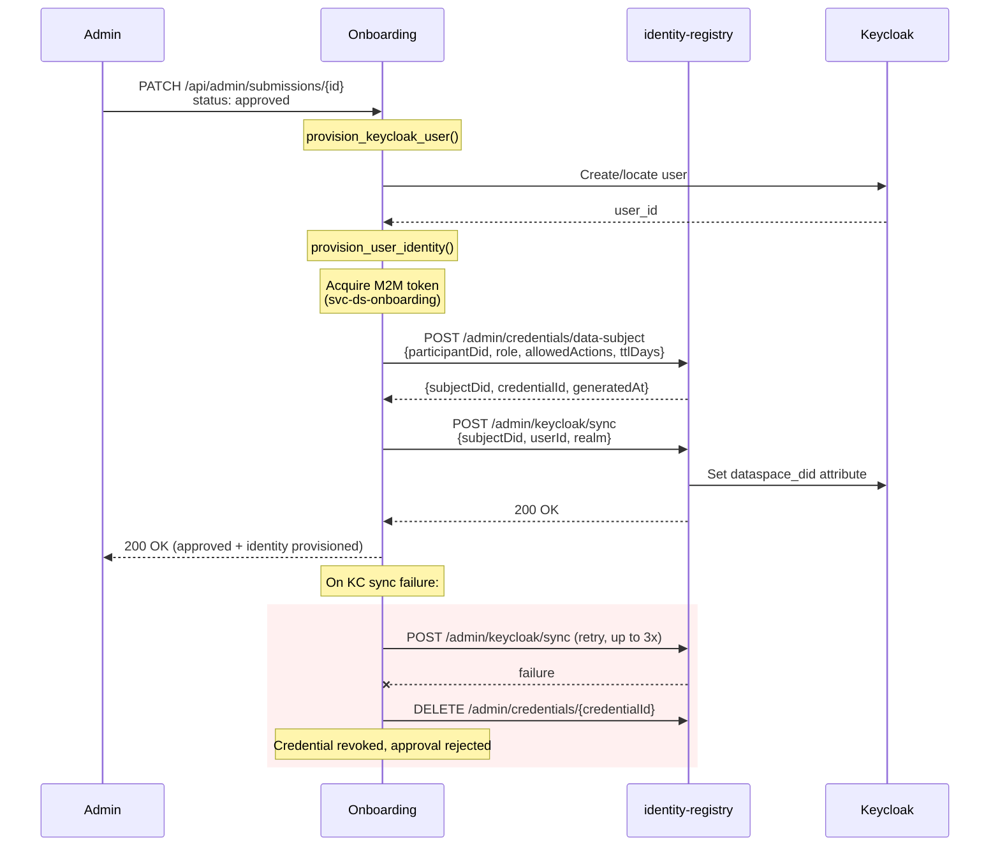

# Dataspace Identity Integration

## Overview

When a user completes onboarding and `DATASPACE_VC_ENABLED` is `true`, the system provisions a dataspace identity for the approved user. This includes:

- A **DID** (Decentralized Identifier) for the user as a data subject
- A **Verifiable Credential** (VC) binding the user to a participant organization
- A **Keycloak `dataspace_did` attribute** linking the user's login identity to their DID

Identity provisioning is triggered when an admin changes a submission's status to `approved`. The onboarding service communicates with the **identity-registry** HTTP API using machine-to-machine (M2M) authentication. If provisioning fails, the approval is rejected -- no partial state is left behind.

Onboarding stores only the subject ID, DID, credential ID, and issuance timestamp. The credential itself lives in the identity-registry's credential store.

## Flow

When a submission is approved and `DATASPACE_VC_ENABLED` is true:

1. `provision_keycloak_user()` creates or locates the Keycloak user and returns the `user_id`.
2. `provision_user_identity()` calls the identity-registry to issue a credential and sync the DID to Keycloak.

### Step-by-step

1. **Keycloak user provisioning** -- `provision_keycloak_user()` creates the user in Keycloak (or finds an existing one) and returns the `user_id`. This runs before identity provisioning so the user ID is available for the sync step.

2. **Credential issuance** -- `POST /admin/credentials/data-subject` sends the participant DID, role, allowed actions, and TTL to the identity-registry. The registry generates a DID for the user, issues a Verifiable Credential, and returns `{subjectDid, credentialId, generatedAt}`.

3. **Keycloak DID sync** -- `POST /admin/keycloak/sync` tells the identity-registry to push the `dataspace_did` attribute onto the Keycloak user. This links the user's login identity to their dataspace DID.

4. **Rollback on failure** -- If the Keycloak sync fails after 3 retries, the credential is revoked via `DELETE /admin/credentials/{credentialId}` and the approval is rejected. This prevents orphaned credentials that have no corresponding Keycloak mapping.

## Authentication

The onboarding service authenticates to identity-registry using **M2M (machine-to-machine) client credentials**:

- **Client**: `svc-ds-onboarding` (configurable via `DS_ONBOARDING_CLIENT_ID`)
- **Auth provider**: `celine.sdk.auth.OidcClientCredentialsProvider` from `celine-sdk>=1.13.0`
- **Token handling**: The provider acquires tokens via the OIDC client credentials flow, caches them in memory, and auto-refreshes before expiry. No manual token management is needed.

The `httpx.AsyncClient` is configured with the auth provider, so all outgoing requests to identity-registry automatically include a valid Bearer token.

## Configuration

### Identity provisioning settings

| Variable | Default | Description |
|---|---|---|
| `DATASPACE_VC_ENABLED` | `false` | Master toggle. When `false`, all dataspace identity provisioning is skipped. |
| `IDENTITY_REGISTRY_URL` | *(none)* | Base URL of the identity-registry service (e.g. `http://identity-registry:8000`). Required when `DATASPACE_VC_ENABLED=true`. |
| `OIDC_BASE_URL` | *(none)* | OIDC issuer URL for M2M token acquisition (e.g. `http://keycloak:8080/realms/dataspace`). Required when `DATASPACE_VC_ENABLED=true`. |
| `DS_ONBOARDING_CLIENT_ID` | `svc-ds-onboarding` | Keycloak client ID for M2M authentication. |
| `DS_ONBOARDING_CLIENT_SECRET` | *(none)* | Keycloak client secret for M2M authentication. Required when `DATASPACE_VC_ENABLED=true`. |

### Dataspace policy settings

These settings control what goes into the issued credential:

| Variable | Default | Description |
|---|---|---|
| `DATASPACE_LINKED_PARTICIPANT_DID` | *(none)* | DID of the participant organization the user is linked to (e.g. `did:web:participant.example.com`). |
| `DATASPACE_USER_ROLE` | *(none)* | Role assigned in the credential (e.g. `member`). |
| `DATASPACE_ALLOWED_ACTIONS` | *(none)* | Comma-separated actions the user is authorized for. |
| `DATASPACE_VC_TTL_DAYS` | *(none)* | Credential validity period in days. |
| `DATASPACE_SUBJECT_SOURCE` | `email_hash` | How the subject identifier is derived. `email_hash` hashes the login email to produce a stable ID without placing raw email in DID paths. |

## Error Handling

The integration follows a **fail-closed** strategy:

- If `DATASPACE_VC_ENABLED` is `true` and identity provisioning fails, the submission status change to `approved` is rejected. The admin sees an error and can retry.
- **Credential revocation on sync failure**: If the credential is issued successfully but the Keycloak sync fails after 3 retries, the credential is revoked via `DELETE /admin/credentials/{credentialId}`. This ensures there are no orphaned credentials without a corresponding Keycloak DID mapping.
- **No partial state**: Either the full provisioning succeeds (credential + KC sync) or nothing is committed. The submission remains in its previous status.

## Dependencies

- `celine-sdk>=1.13.0` -- provides `celine.sdk.auth.OidcClientCredentialsProvider` for M2M token management
- `httpx` -- async HTTP client for identity-registry API calls
- **identity-registry** service -- must be deployed and accessible at `IDENTITY_REGISTRY_URL`
- **Keycloak** -- must have the `svc-ds-onboarding` client configured with appropriate permissions
