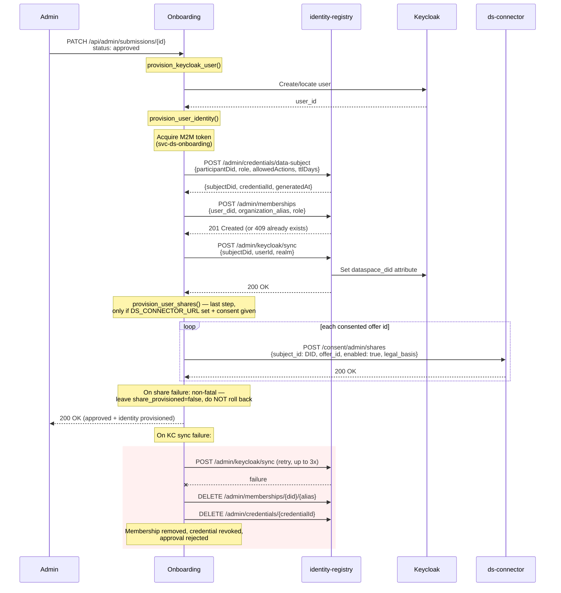

# Dataspace Identity Integration

## Overview

Dataspace identity provisioning needs **two gates open**: `DATASPACE_ENABLED` for the deployment, and a `dataspace:` block in that community's manifest. A REC without a block gets no credential even when the deployment is enabled — issuing one would hand somebody an identity belonging to no organization, which the consent endpoints refuse to act on anyway.

Keycloak user creation is a **separate** gate (`DATASPACE_KEYCLOAK_ENABLED`), so it can be used on its own: participants get a login, and no dataspace is involved.

When both gates are open and a submission is approved, the system provisions a dataspace identity for that user. This includes:

- A **DID** (Decentralized Identifier) for the user as a data subject
- A **Verifiable Credential** (VC) binding the user to a participant organization
- An **organization membership** registering the DID as a member of the REC in the identity-registry
- A **Keycloak `dataspace_did` attribute** linking the user's login identity to their DID
- **Data-sharing shares** provisioned to the dataspace connector for the offers the user consented to during onboarding (optional; runs last and is non-fatal)

The membership matters as much as the credential: ds consent endpoints (`/consent/my/shares`) check membership before allowing a data subject to manage sharing preferences. A user with a VC but no membership holds a valid identity that cannot do anything.

Identity provisioning is triggered when an admin changes a submission's status to `approved`. The onboarding service communicates with the **identity-registry** HTTP API using machine-to-machine (M2M) authentication. If provisioning fails, the approval is rejected -- no partial state is left behind.

Onboarding stores only the subject ID, DID, credential ID, and issuance timestamp. The credential itself lives in the identity-registry's credential store.

## Flow

When a submission is approved, `DATASPACE_ENABLED` is true and the REC declares a `dataspace:` block:

1. `provision_keycloak_user()` creates or locates the Keycloak user and returns the `user_id`.
2. `provision_user_identity()` calls the identity-registry to issue a credential and sync the DID to Keycloak, then provisions any data-sharing shares to the connector as its last step.



### Step-by-step

1. **Keycloak user provisioning** -- `provision_keycloak_user()` creates the user in Keycloak (or finds an existing one) and returns the `user_id`. This runs before identity provisioning so the user ID is available for the sync step.

2. **Credential issuance** -- `POST /admin/credentials/data-subject` sends the participant DID, role, allowed actions, and TTL to the identity-registry. The registry generates a DID for the user, issues a Verifiable Credential, and returns `{subjectDid, credentialId, generatedAt}`.

3. **Organization** -- onboarding **does not create one**, by design. See "Why onboarding never creates an organization" below. The organization named by the REC's manifest must already exist and be promoted in the identity registry; a `404` from the membership call means it was never seeded, and says so.

4. **Membership registration** -- `POST /admin/memberships` registers the user's DID as a member of the REC organization with the manifest's `dataspace.membership_role`. A `409 Conflict` is treated as success; a `404` means the organization does not exist. Without this step the user cannot use the ds consent endpoints, which gate on `GET /memberships/check`.

5. **Keycloak DID sync** -- `POST /admin/keycloak/sync` tells the identity-registry to push the `dataspace_did` attribute onto the Keycloak user. This links the user's login identity to their dataspace DID.

6. **Rollback on failure** -- If the Keycloak sync fails after 3 retries, the membership is removed via `DELETE /admin/memberships/{did}/{alias}`, the credential is revoked via `DELETE /admin/credentials/{credentialId}`, and the approval is rejected. This prevents orphaned credentials and memberships that have no corresponding Keycloak mapping.

7. **Data-sharing share provisioning** -- `provision_user_shares()` runs as the last step, after the Keycloak DID sync. When `DS_CONNECTOR_URL` is set and the submission's `data_sharing_consent` is true, it POSTs once per recorded offer id to `{DS_CONNECTOR_URL}/consent/admin/shares` with body `{subject_id: <dataspace DID>, offer_id, enabled: true, legal_basis: {source: "onboarding", rec_slug, consent_text_version, locale, rendered_text_sha256, accepted_at, submission_ref}}`. It names an offer, never a dataset. The call is idempotent and sets `share_provisioned=true` on success. Unlike step 6, it is **deliberately non-fatal**: a failed share never rolls back the identity or rejects the approval -- it leaves `share_provisioned=false` for retry. Onboarding authenticates with its `svc-ds-onboarding` service token (scope `connector.consent.provision`, audience `svc-ds-connector`).

Step 4 is skipped entirely when the REC's manifest declares no `dataspace.organization`. Step 7 is skipped when `DS_CONNECTOR_URL` is unset.

### Retrying a failed share

`POST /api/admin/submissions/{id}/retry-share` re-runs `provision_user_shares()` with `raise_on_error=True`, returning `422` if the connector rejects the request. Use it to complete provisioning for a submission left at `share_provisioned=false`.

## Authentication

The onboarding service authenticates to identity-registry using **M2M (machine-to-machine) client credentials**:

- **Client**: `svc-ds-onboarding` (configurable via `DS_ONBOARDING_CLIENT_ID`)
- **Auth provider**: `celine.sdk.auth.OidcClientCredentialsProvider` from `celine-sdk>=1.13.0`
- **Token handling**: The provider acquires tokens via the OIDC client credentials flow, caches them in memory, and auto-refreshes before expiry. No manual token management is needed.

The `httpx.AsyncClient` is configured with the auth provider, so all outgoing requests to identity-registry automatically include a valid Bearer token. The same `svc-ds-onboarding` service token is used for the connector share-provisioning calls, carrying the `connector.consent.provision` scope and `svc-ds-connector` audience.

## Configuration

### Identity provisioning settings

| Variable | Default | Description |
|---|---|---|
| `DATASPACE_ENABLED` | `false` | Deployment-wide gate. When `false`, no dataspace identity provisioning happens anywhere. Keycloak user creation is gated separately by `DATASPACE_KEYCLOAK_ENABLED`, so it can be used on its own to give participants a login without any dataspace. |
| `IDENTITY_REGISTRY_URL` | *(none)* | Base URL of the identity-registry service (e.g. `http://identity-registry:8000`). Required when `DATASPACE_ENABLED=true`. |
| `OIDC_BASE_URL` | *(none)* | OIDC issuer for M2M token acquisition — the **`celine` realm** (e.g. `http://keycloak.celine.localhost/realms/celine`). One realm for every outbound call this app makes; realm alignment converges there, so do not point it at the dataspaces realm. Required when `DATASPACE_ENABLED=true`. |
| `DS_ONBOARDING_CLIENT_ID` | `svc-ds-onboarding` | Keycloak client ID for M2M authentication. |
| `DS_ONBOARDING_CLIENT_SECRET` | *(none)* | Keycloak client secret for M2M authentication. Required when `DATASPACE_ENABLED=true`. |

### Dataspace policy settings

These settings control what goes into the issued credential:

| Variable | Default | Description |
|---|---|---|
| `DATASPACE_USER_ROLE` | *(none)* | Role assigned in the credential (e.g. `member`). |
| `DATASPACE_ALLOWED_ACTIONS` | *(none)* | Comma-separated actions the user is authorized for. |
| `DATASPACE_VC_TTL_DAYS` | *(none)* | Credential validity period in days. |
| `DATASPACE_SUBJECT_SOURCE` | `email_hash` | How the subject identifier is derived. `email_hash` hashes the login email to produce a stable ID without placing raw email in DID paths. |

### The per-community binding lives in the manifest

Which dataspace organization a community's members belong to is **not** a
deployment setting. It is per community, in `templates/<slug>/manifest.yaml`:

```yaml
dataspace:
  organization: example-community          # = KC org alias = IR owner id
  organization_did: did:web:example-community.dataspaces.localhost
  linked_participant_did: did:web:consumer.dataspaces.localhost
  membership_role: member                  # optional, defaults to "member"
```

| Key | Notes |
|---|---|
| `organization` | Owner `id` in the identity registry. Must match `^[a-z0-9][a-z0-9-]*[a-z0-9]$` and an owner that already exists there. Validated by `task import-templates`. |
| `organization_did` | Optional DID for the organization; used as the disclosing agent on provenance events. |
| `linked_participant_did` | Optional participant the issued credential is linked to. |
| `membership_role` | Role recorded on the membership. |

`organization` is **required** when the block is present. There is no "in the
dataspace but a member of nothing" state: a credential without a membership is an
identity that cannot do anything, since the consent endpoints gate on membership.

**Omit the whole block and the community is not in the dataspace**: the full
wizard runs, no sharing consent is collected and no identity is provisioned. That
is a supported configuration — onboarding works with no dataspace infrastructure
at all — not a degraded one.

The binding is per community because this platform is multi-tenant: manifests
live in the `Rec` table, every wizard route is `/api/{rec}/…` and every submission
carries a `rec_slug`. As deployment-wide settings, these filed **every** approved
member into one organization, silently — the wrong membership is still a
successful `201`.

There is deliberately **no deployment-wide equivalent**. A global alias is what
produced the defect above, and leaving one as a fallback would let it come back
the first time a manifest was written without a block.

### Why onboarding never creates an organization

`POST /admin/owners` is not called, and the capability was removed rather than
defaulted off.

An organization created from an approval carries **no verification, no agreement
and therefore no declared capacity** — and the registry's `status` column
defaults to `verified`, so such a row *reads* as verified while nothing verified
it. Capacity is what the connector's circle check reads to decide whether a party
requesting data is a processor of the controller (disclosed under a DPA) or an
independent controller (a new consent question for the member). With none
declared, the check resolves "outside the circle": the safe direction, for the
wrong reason, invisibly.

Organizations arrive through the registry's **verify → agreement → credential →
promote** chain, seeded by an operator from the deployment's `owners.yaml`. A
missing organization is a deployment error:

- at startup, the service **refuses to boot** when a bound community's
  organization is unknown to the registry;
- a registry that cannot be reached does *not* block boot — "no such owner" is a
  configuration error worth refusing on, "I could not ask" is not;
- at approval, a `404` from the membership call says the organization was never
  seeded.

### Data-sharing share settings

These control provisioning of data-sharing consent to the dataspace connector (step 7).

| Variable | Default | Description |
|---|---|---|
| `DS_CONNECTOR_URL` | *(none)* | Connector base URL for provisioning standing consent (`POST /consent/admin/shares`). When unset, share provisioning is skipped. |
| `DS_NS_URL` | *(none)* | Public vocabulary base (`GET /ns/sharing-offers`) the wizard renders offers from. When unset, falls back to the connector's `/ns` path. |

## Relation to REC registry registration

Approval provisions three things in order — Keycloak user, REC registry member,
dataspace identity — and the order is not cosmetic. The registry keys a member on
`(community, user_id)`, so the Keycloak user exists first; the dataspace identity
is last because it is the step that can be retried afterwards.

Registry registration **fails closed**, so a dataspace identity is never issued
to somebody who is not a community member. See `AGENTS.md` for what is derived
from the wizard's answers and what is deliberately not.

The traffic goes the other way once, too. After the dataspace identity step
succeeds, onboarding writes the minted DID back onto the registry member with
`PATCH /communities/{community}/members/{key}`, sending `did` and nothing else.
This is what lets the rest of the platform join a dataspace consent — which the
connector answers in DIDs — to the member who holds the supply points. It is a
second call rather than a field on the create because the DID does not exist when
the member is registered, and it fails the step when the registry refuses: `did`
is globally unique there, so a `409` means another member already holds it, and
retrying will not clear that.

The member carries two identifiers and they are not interchangeable. `key` is the
registry's own handle on the member and is the submission reference. `user_id` is
**the Keycloak username** — read back from provisioning, falling back to the
normalised email — because the registry resolves a self-service caller by matching
that column against their token's `preferred_username`. A member row holding
anything else looks correct everywhere and its owner is told `403 You are not a
member of any community` on every self-service route.

## Error Handling

The integration follows a **fail-closed** strategy:

- If `DATASPACE_ENABLED` is `true` and identity provisioning fails, the submission status change to `approved` is rejected. The admin sees an error and can retry.
- **Credential revocation on sync failure**: If the credential is issued successfully but the Keycloak sync fails after 3 retries, the membership is deleted and the credential is revoked via `DELETE /admin/credentials/{credentialId}`. This ensures there are no orphaned credentials or memberships without a corresponding Keycloak DID mapping.
- **Idempotent membership calls**: `409 Conflict` from `POST /admin/memberships` is treated as success, so re-approving or retrying a failed approval does not error out. A `404` names the missing organization. Any other 4xx/5xx aborts the approval.
- **Incomplete consent evidence is refused locally**: a data-sharing consent with no `consent_text_version` or no `rendered_text_sha256` is rejected at capture, and `provision_user_shares` pre-flights the same rule rather than sending a record the connector will `422`. That rejection is permanent — you cannot retrospectively prove what somebody was shown — so it is surfaced on the admin view rather than left in a log.
- **No partial state**: Either the full provisioning succeeds (credential + organization + membership + KC sync) or nothing is committed. The submission remains in its previous status.
- **Share provisioning is non-fatal**: Data-sharing share provisioning (step 7) runs after the identity is committed and is exempt from fail-closed. A connector rejection or error leaves `share_provisioned=false` and logs, but never rolls back the identity or the approval. Operators retry via `POST /api/admin/submissions/{id}/retry-share` (which surfaces connector rejections as `422`).

## Dependencies

- `celine-sdk>=1.13.0` -- provides `celine.sdk.auth.OidcClientCredentialsProvider` for M2M token management
- `httpx` -- async HTTP client for identity-registry API calls
- **identity-registry** service -- must be deployed and accessible at `IDENTITY_REGISTRY_URL`
- **ds-connector** service -- required only for data-sharing share provisioning; must be accessible at `DS_CONNECTOR_URL`
- **Keycloak** -- must have the `svc-ds-onboarding` client configured with appropriate permissions, including the `connector.consent.provision` scope and `svc-ds-connector` audience for share provisioning
