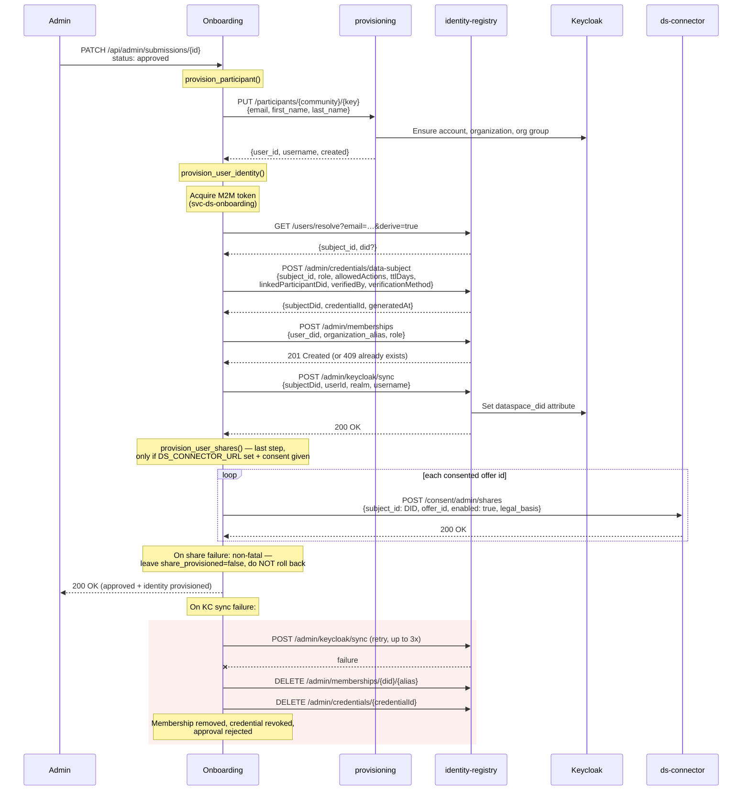

# Dataspace Identity Integration

## Overview

Dataspace identity provisioning needs **two gates open**: `DATASPACE_ENABLED` for the deployment, and a `dataspace:` block in that community's manifest. A REC without a block gets no credential even when the deployment is enabled — issuing one would hand somebody an identity belonging to no organization, which the consent endpoints refuse to act on anyway.

Provisioning a participant's **login** is a separate gate (`PROVISIONING_URL`), so it can be used on its own: participants get a login, and no dataspace is involved. It is not a Keycloak call from here -- see [Participant login settings](#participant-login-settings).

When both gates are open and a submission is approved, the system provisions a dataspace identity for that user. This includes:

- A **DID** (Decentralized Identifier) for the user as a data subject
- A **Verifiable Credential** (VC) binding the user to a participant organization
- An **organization membership** registering the DID as a member of the REC in the identity-registry
- A **Keycloak `dataspace_did` attribute** linking the user's login identity to their DID (written by the identity registry, not from here)
- **Data-sharing shares** provisioned to the dataspace connector for the offers the user consented to during onboarding (optional; runs last and is non-fatal)

The membership matters as much as the credential: ds consent endpoints (`/consent/my/shares`) check membership before allowing a data subject to manage sharing preferences. A user with a VC but no membership holds a valid identity that cannot do anything.

Identity provisioning is triggered when an admin changes a submission's status to `approved`. The onboarding service communicates with the **identity-registry** HTTP API using machine-to-machine (M2M) authentication. If provisioning fails, the approval is rejected -- no partial state is left behind.

Onboarding stores only the subject ID, DID, credential ID, and issuance timestamp. The credential itself lives in the identity-registry's credential store.

## Flow

When a submission is approved, `DATASPACE_ENABLED` is true and the REC declares a `dataspace:` block:

1. `provision_participant()` asks the provisioning service to ensure the account, and to invite the participant to set a password, and returns its Keycloak `user_id`, `username` and the invitation outcome.
2. `provision_user_identity()` calls the identity-registry to issue a credential and sync the DID to Keycloak, then provisions any data-sharing shares to the connector as its last step.



Provisioning takes **facts, not a database row**. `provision_subject(access, facts, binding)` is the whole of it, and `provision_user_identity(submission, ...)` is the approval path's caller: it reads a `SubjectFacts` off the submission and writes the resulting `SubjectIdentity` back. A person who was admitted some other way -- screened offline, with no submission and never one -- is provisioned by filling in the same facts from wherever their admission is recorded. `RegistryAccess` carries the registry URL and one token through the whole flow, so resolve, check and issue cannot address different instances.

### Step-by-step

1. **Login provisioning** -- `provision_participant()` calls `PUT /participants/{community}/{key}` on the provisioning service, which ensures the account, its REC organization and its org group, and returns the Keycloak `user_id` and the `username` the account authenticates as. The body always carries `invite: true` and, when there is one, the participant's `locale` (see [The invitation](#the-invitation)); the answer's `invitation` code is recorded on the step row. Nothing here touches Keycloak; see [Participant login settings](#participant-login-settings). This runs before identity provisioning so the user id is available for the sync step.

2. **Subject resolution** -- `GET /users/resolve?email=…&derive=true` asks the identity-registry who this person is. It is the sole authority on the email-to-`subject_id` mapping: an existing one comes back, and a new one is derived deterministically, keyed by the registry's own `ENCRYPTION_KEY`, so first-time issuance has an identifier without onboarding inventing one. A missing mapping is therefore **not** a `404`. Skipped when `DATASPACE_SUBJECT_SOURCE` is `submission_ref`, where the identifier comes from the submission instead.

    A **`409`** means the identifier matches a mapping carrying a different Keycloak user id. The registry quarantines rather than reconciles, because "account re-created" and "address recycled to a different human" are indistinguishable from there. It surfaces as `SubjectIdentifierConflictError` and is logged at error level with the identifiers: only an operator can resolve it, and retrying never will.

3. **Credential issuance** -- `POST /admin/credentials/data-subject` sends the subject id, role, allowed actions, TTL and the REC's `linked_participant_did` to the identity-registry. The registry derives the user's DID, issues a Verifiable Credential, and returns `{subjectDid, credentialId, generatedAt}`.

    It also sends **`verified_by` and `verification_method`** -- who established this person's identity, and how. The dataspace layer does no KYC by design; whoever runs onboarding does, and the credential records it rather than implying an assurance level nobody established. `verified_by` is the REC's `dataspace.organization_did`, omitted when the manifest declares none, because naming an empty authority is worse than naming none. `verification_method` is `submission-review` followed by the method the operator recorded before approving — `submission-review:offline` or `submission-review:uploaded-document` (see [Operator console](admin-console.md#before-approving-the-recs-verification)). It is never a setting: a deployment able to edit it could make the credential claim a check that never happened. A submission approved before verifications were recorded, whose enablement is retried, sends the bare `submission-review`. The value is plain text in `credentialSubject.verificationMethod`; the word is also the W3C DID-document term, with a different meaning.

    **Issuance is idempotent per role.** The registry reuses the subject DID -- one human keeps one identifier across organisations -- and a repeat call for somebody who already holds an active credential *in the same role* returns that credential's id and re-delivers it to the custodian, rather than minting a second one and spending a status-list index that is never recovered. A different role does mint, because roles are additive. This was **not** true when the two doors below were written -- every call minted -- and both guards remain correct for reasons that have moved.

    The **approval path** does not guard: a manager has just approved this submission, and the row needs a `dataspace_vc_id` of its own to stay revocable, which it gets whether the registry minted or matched, since the response names the credential either way. The **member's wizard** guards by resolving first and provisioning only when `resolve_subject_and_credential` answers `None` -- a stronger question than `GET /credentials/check` (it asks whether the member holds an *active, unexpired and presentable* credential, which is what they actually need) and asked with a call that path already makes. The registry's own per-role match is a floor and not a substitute for it: it says a credential exists, not that this service can resolve one to present. `/credentials/check` and the `identity-registry.credentials.read` grant it would have needed are therefore not used here.

4. **Organization** -- onboarding **does not create one**, by design. See "Why onboarding never creates an organization" below. The organization named by the REC's manifest must already exist and be promoted in the identity registry; a `404` from the membership call means it was never seeded, and says so.

5. **Membership registration** -- `POST /admin/memberships` registers the user's DID as a member of the REC organization. A `409 Conflict` is treated as success; a `404` means the organization does not exist. Without this step the user cannot use the ds consent endpoints, which gate on `GET /memberships/check`.

    **No role is sent.** A membership says *where* somebody belongs; what they are there is a `communityRole` claim on their data-subject credential, changed by reissuing it. The registry once accepted a role here and stored it in a column nothing read, and has since dropped the column -- so a manifest's `dataspace.membership_role` recorded nothing while reading as though it did. The key is gone; a manifest that still carries it is ignored rather than rejected.

6. **Keycloak DID sync** -- `POST /admin/keycloak/sync` tells the identity-registry to push the `dataspace_did` attribute onto the Keycloak user. This links the user's login identity to their dataspace DID. The identity registry writes it, not this service: the attribute is the one Keycloak write in this flow that never went through the participants grant, which is why it survived the grant's removal unchanged.

    It also sends the **username** Keycloak returned at step 1 -- the same value step 2 of enablement wrote into `Member.user_id`. That is what lets a dataspace decision be applied to rows: the connector translates consenting subject DIDs into usernames through this registry (`POST /users/identities`, which reads `KeycloakMapping.username` and falls back to `email`) and hands them to the celine `dataset-api`, which resolves them against `Member.user_id`. Sending it keeps both ends naming one person the same way. Omitting it leaves the email fallback standing, which is correct only while username == email -- the convention the provisioning service uses for an account it *creates*, and **not** the platform's: it also adopts an account whose username is something else, and for them the row filter would resolve nobody and the data plane would deny rows a person had consented to. The value is optional because a retry of step 3 alone has no provisioning result to read it from; the key is then omitted rather than sent as null, so a good value already in the registry is never overwritten with nothing.

7. **Rollback on failure** -- If the Keycloak sync fails after 3 retries, the membership is removed via `DELETE /admin/memberships/{did}/{alias}`, the credential is revoked via `DELETE /admin/credentials/{credentialId}`, and the approval is rejected. This prevents orphaned credentials and memberships that have no corresponding Keycloak mapping.

8. **Data-sharing share provisioning** -- `provision_user_shares()` runs as the last step, after the Keycloak DID sync. When `DS_CONNECTOR_URL` is set and the submission's `data_sharing_consent` is true, it POSTs once per recorded offer id to `{DS_CONNECTOR_URL}/consent/admin/shares` with body `{subject_id: <dataspace DID>, offer_id, enabled: true, legal_basis: {source: "onboarding", rec_slug, consent_text_version, locale, rendered_text_sha256, accepted_at, submission_ref}}`. It names an offer, never a dataset. The call is idempotent and sets `share_provisioned=true` on success. Unlike step 7, it is **deliberately non-fatal**: a failed share never rolls back the identity or rejects the approval -- it leaves `share_provisioned=false` for retry. Onboarding authenticates with its `svc-ds-onboarding` service token (scope `connector.consent.provision`, audience `svc-ds-connector`).

   **An offer controlled by another organisation takes the member's own route.** ds records a service's standing share only for a member of the offer's controller, so an offer the member accepted in the form whose controller is not their community — a distributor releasing their readings, an operator's own research — is recorded right after, through `POST /consent/my/shares`, presented with the member's freshly issued credential (`X-Subject-Id`, `X-User-VC`). The decision is the member's, made once in the form; nothing is decided for them, and a credential naming anyone but the submission's DID is never presented. Controllers are compared by DID. If the controller cannot be determined, the offer stays on the service route, where ds refuses what it would not grant. That route carries no form evidence, which stays on the submission; the connector stamps the offer's own version and hash. Withdrawal at revocation takes the same route the grant took, before the credential is deleted.

Step 5 is skipped entirely when the REC's manifest declares no `dataspace.organization`. Step 8 is skipped when `DS_CONNECTOR_URL` is unset.

### Retrying a failed share

`POST /api/admin/submissions/{id}/retry-share` re-runs `provision_user_shares()` with `raise_on_error=True`, returning `422` if the connector rejects the request. Use it to complete provisioning for a submission left at `share_provisioned=false`.

## Authentication

The onboarding service authenticates to identity-registry using **M2M (machine-to-machine) client credentials**:

- **Client**: `svc-ds-onboarding` (configurable via `DS_ONBOARDING_CLIENT_ID`)
- **Auth provider**: `celine.sdk.auth.OidcClientCredentialsProvider` from `celine-sdk>=1.13.0`
- **Token handling**: The provider acquires tokens via the OIDC client credentials flow, caches them in memory, and auto-refreshes before expiry. No manual token management is needed.

The `httpx.AsyncClient` is configured with the auth provider, so all outgoing requests to identity-registry automatically include a valid Bearer token. The same `svc-ds-onboarding` service token is used for the connector calls, carrying `connector.consent.provision` for share provisioning, `connector.consent.audience` for reading a decision back, `connector.disclosure.record` for the disclosure, and the `svc-ds-connector` audience.

`connector.consent.audience` is separate from `.provision` deliberately: provisioning is part of ds's `ds-participant-admin` bundle, and a write grant must not carry bulk subject enumeration with it. It is what `GET /consent/admin/shares` requires, and the POD export is its only caller here.

The same token carries **`rec-registry.lookup`** for the other half of that export: the DIDs the connector returns are resolved to supply points through `POST /admin/lookup/members-by-dids` on the rec-registry, which is also where `set_member_did` wrote the DID at step 6. One grant covers both lookup actions -- `rec_registry/access.rego` grants `lookup` and `assets.lookup` from it -- so there is no `rec-registry.assets.lookup` to declare. It is granted in `celine-policies/clients.ds-host.yaml`, the host overlay, because `rec-registry.*` is celine's vocabulary added on top of a client ds declares.

## Configuration

### Identity provisioning settings

| Variable | Default | Description |
|---|---|---|
| `DATASPACE_ENABLED` | `false` | Deployment-wide gate. When `false`, no dataspace identity provisioning happens anywhere. Participant logins are gated separately by `PROVISIONING_URL`, so they can be used on their own to give participants a login without any dataspace. |
| `IDENTITY_REGISTRY_URL` | *(none)* | Base URL of the identity-registry service (e.g. `http://identity-registry:8000`). Required when `DATASPACE_ENABLED=true`. |
| `OIDC_BASE_URL` | *(none)* | OIDC issuer for M2M token acquisition — the **`celine` realm** (e.g. `http://keycloak.celine.localhost/realms/celine`). One realm for every outbound call this app makes; realm alignment converges there, so do not point it at the dataspaces realm. Required when `DATASPACE_ENABLED=true`. |
| `DS_ONBOARDING_CLIENT_ID` | `svc-ds-onboarding` | Keycloak client ID for M2M authentication. |
| `DS_ONBOARDING_CLIENT_SECRET` | *(none)* | Keycloak client secret for M2M authentication. Required when `DATASPACE_ENABLED=true`. |

### Participant login settings

This service **holds no Keycloak grant at all**, and a deployment that gives it one is
refused at boot. Approval asks `celine-policies`' **provisioning service** for the login
instead -- one service, the only writer of participant accounts in the realm, reachable
only from inside the network.

It used to administer the realm itself, under a fine-grained admin permission over one
group (`/participants`). That was the narrowest grant Keycloak can express and it was
wrong twice over: a service facing the public wizard held admin rights over accounts, and
it could not finish the job anyway -- a participant's community membership is a Keycloak
**organization**, which the Organizations API owns and no fine-grained permission reaches.
Accounts landed in a group and in no organization, which is the claim every org-scoped
policy resolves them by. See
[ADR-0004](decisions/ADR-0004-ask-the-provisioning-service-instead-of-administering-the-realm.md).

The two identities this service holds are granted by different people for different
things, and asking for a login in celine's realm is celine's business:

| Identity | Is | Used for |
|---|---|---|
| `OIDC_CLIENT_ID` (`svc-onboarding`) | celine's own client | Asking the provisioning service for a login -- a **scope**, not a Keycloak grant |
| `DS_ONBOARDING_CLIENT_ID` (`svc-ds-onboarding`) | the dataspace's client | Identity registry, connector, registry lookups |

### The two calls, and what they are keyed on

| Call | When |
|---|---|
| `PUT /participants/{community}/{key}` | enablement step 1, on approval |
| `POST /participants/{community}/{key}/disable` | revocation |

`community` is the REC manifest's `rec_registry.community` and `key` is `submission.ref`
-- exactly the pair this service already registers the member under. One alias from one
place, because the provisioning service files the account into that community's Keycloak
organization, and the sweep that later checks the filing reads the community's own id from
the registry export.

The scope is `provisioning.participants.write`, declared for `svc-onboarding` in
`celine-policies`' `clients.yaml` together with the audience mapper onto
`svc-provisioning`. It is not granted by hand; `keycloak sync` applies it.

**`username` comes back from the call and is never computed here.** The provisioning
service reads it off the account, which may authenticate under a convention this platform
never chose -- a participant seeded from a registry file, or an account made by hand. That
value is what becomes the registry's `Member.user_id`; the response's `user_id` is the
Keycloak uuid, which is a different thing with an unfortunately similar name.

**A REC that declares no `rec_registry` block gets no login**, and step 1 says so.
Revocation resolves `(community, key)` through the registry export, so a login provisioned
for such a REC could never be revoked through this seam -- and the community alias would
have to be invented, creating an organization no reconcile looks at. An unrevokable login
is worse than an absent one.

**Revocation closes the login before it deactivates the member.** The registry export
carries only `active` members, so the reverse order would make the disable a `404`: the
login survives, the participant can still sign in, and the step row reports success
because nothing failed. `enablement.REVOKE_ORDER` declares the order for that reason.

### The invitation

Every upsert from step 1 carries `invite: true`, including a retry. This service
cannot see credentials, so it does not decide whether an account needs an
invitation: the provisioning service sends one only to an account created in that
call or one without a password, and at most one email per account within its
cooldown, which is also what makes a retry safe. Keycloak writes the email; nothing
here sends one about the login.

`locale` is the submission's own (the language the person last used in the wizard),
then the REC manifest's `locale`, then absent, which leaves the realm default. Both
are **narrowed to `it|en|es`, and anything else is sent as absent**: the service
answers `422` for any other value, and a `422` would fail step 1 closed and block an
approval over a language tag. A manifest saying `it-IT` therefore gets the realm
default, which is the email Keycloak would have sent anyway.

The answer's `invitation` is `sent`, `has_password`, `not_on_dev_list`,
`account_disabled`, `not_requested`, `cooldown`, `send_failed` or `no_email`, and none
of them fails the step. It is stored on the step row beside `detail`, and the console
translates it ([Operator console](admin-console.md#the-invitation-for-the-operator)).
`account_disabled` is a participant approved again after revocation: revocation
disables the account, and neither answer re-enables it. `send_failed` is the one
outcome a retry that names `keycloak_user` re-runs although the step succeeded;
`cooldown` and `no_email` are not re-run.

The provisioning service is also called a second way, from outside approval. A community
manager's "Send invitation" and "Reset password" on the `celine-community` dashboard reach
`POST /participants/{community}/{key}/invitation` through this service's member-keyed routes.
Those calls name the intent, pass every code through, and touch no step row. See
[api-reference.md](api-reference.md) and
[ADR-0005](decisions/ADR-0005-onboarding-is-the-one-caller-of-the-provisioning-service.md).

### What each refusal means

| | Meaning |
|---|---|
| `401` | The credential did not verify. Check `OIDC_CLIENT_SECRET`. Reported as a misconfiguration -- a platform operator's to fix, not the reviewing operator's to read |
| `403` | It verified and does not carry `provisioning.participants.write`. The `clients.yaml` declaration has not been synced. Also a misconfiguration |
| `404` `member_not_found`, `account_not_found` | On a revocation: no member under that key, or no account for one. Counted as done, because there is nothing left to revoke |
| `404` `community_not_found` | The REC manifest's `rec_registry.community` names a community the registry does not hold. Reported as a misconfiguration, and on a revocation it **fails the step**: the service could not look the member up, so a login may still be enabled |
| `404` with any other code, or none | Fails the step. A codeless `404` is as likely a wrong `PROVISIONING_URL` as a missing member, so it is never read as "nothing to revoke" |
| `502` `registry_unavailable`, `provisioning_failed`, `send_failed` | The registry or Keycloak failed behind the provisioning service. **A dependency, not a refusal** -- the retryable case the step row exists for, and the step error names which |

Every refusal carries `{"detail": {"code", "message"}}` since the provisioning service's
1.2.0 contract, and this service branches on the `code` (`ProvisioningApiError.code`),
never on the message. The message goes to the log.

Enablement sees no `409` any more, and nothing to adopt by hand: the provisioning
service has realm-wide reach, so an account created by anything else is found by address
and adopted. ADR-0003's unreachable-duplicate case is gone with the grant that caused it.

| Variable | Default | Description |
|---|---|---|
| `PROVISIONING_URL` | *(none)* | The provisioning service's **internal** address (`http://provisioning:8010` under compose). Unset onboards participants and gives them no login, which is a supported deployment. It has no public route and must not be given one: it holds realm-wide Keycloak administration and is safe to hold it only because nothing outside the network can reach it. |
| `OIDC_CLIENT_SECRET` | *(none)* | The secret for `OIDC_CLIENT_ID`, presented to the provisioning service. Required when `PROVISIONING_URL` is set. |
| `DATASPACE_KEYCLOAK_REALM` | *(the realm `OIDC_BASE_URL` names)* | The realm the account **lives in**, which the dataspace step hands to the identity registry. Not an administration setting -- nothing here administers a realm. Set it only where the issuer URL names no realm; startup refuses a pair that disagrees, because the provisioning service writes into the realm this deployment's own issuer names. |

`DATASPACE_KEYCLOAK_ADMIN_USERNAME`, `_ADMIN_PASSWORD` and `_ADMIN_CLIENT_SECRET` were the
password-grant login as a realm administrator. `DATASPACE_KEYCLOAK_ENABLED`, `_BASE_URL`,
`_PARTICIPANTS_GROUP` and `_UPDATE_EXISTING` configured the group-scoped grant and are gone
with it. **Startup refuses to run with any of them set** -- remove them, rotate what the
credentials held, and keep `_REALM`. `ENABLED=true` is the one that has to be refused
rather than warned about: it reads as "participants are being given logins" while nothing
reads it, so none would be, one approval at a time. See
[ADR-0001](decisions/ADR-0001-provision-logins-as-the-service.md) through
[ADR-0004](decisions/ADR-0004-ask-the-provisioning-service-instead-of-administering-the-realm.md).

### Dataspace policy settings

These settings control what goes into the issued credential:

| Variable | Default | Description |
|---|---|---|
| `DATASPACE_USER_ROLE` | *(none)* | Role assigned in the credential (e.g. `member`). |
| `DATASPACE_ALLOWED_ACTIONS` | *(none)* | Comma-separated actions the user is authorized for. |
| `DATASPACE_VC_TTL_DAYS` | *(none)* | Credential validity period in days. |
| `DATASPACE_SUBJECT_SOURCE` | `email_hash` | How the subject identifier is derived. `email_hash` hashes the login email to produce a stable ID without placing raw email in DID paths. |

### The per-community binding lives in the manifest

Which dataspace organization a community's members belong to is **not** a
deployment setting. It is per community, in `templates/<slug>/manifest.yaml`:

```yaml
dataspace:
  organization: example-community          # = KC org alias = IR owner id
  organization_did: did:web:example-community.dataspaces.localhost
  linked_participant_did: did:web:consumer.dataspaces.localhost
```

| Key | Notes |
|---|---|
| `organization` | Owner `id` in the identity registry. Must match `^[a-z0-9][a-z0-9-]*[a-z0-9]$` and an owner that already exists there. Validated by `task import-templates`. |
| `organization_did` | Optional DID for the organization; used as the disclosing agent on provenance events. |
| `linked_participant_did` | Optional participant the issued credential is linked to. |

`organization` is **required** when the block is present. There is no "in the
dataspace but a member of nothing" state: a credential without a membership is an
identity that cannot do anything, since the consent endpoints gate on membership.

**Omit the whole block and the community is not in the dataspace**: the full
wizard runs, no sharing consent is collected and no identity is provisioned. That
is a supported configuration — onboarding works with no dataspace infrastructure
at all — not a degraded one.

The binding is per community because this platform is multi-tenant: manifests
live in the `Rec` table, every wizard route is `/api/{rec}/…` and every submission
carries a `rec_slug`. As deployment-wide settings, these filed **every** approved
member into one organization, silently — the wrong membership is still a
successful `201`.

There is deliberately **no deployment-wide equivalent**. A global alias is what
produced the defect above, and leaving one as a fallback would let it come back
the first time a manifest was written without a block.

### Why onboarding never creates an organization

`POST /admin/owners` is not called, and the capability was removed rather than
defaulted off.

An organization created from an approval carries **no verification, no agreement
and therefore no declared capacity** — and the registry's `status` column
defaults to `verified`, so such a row *reads* as verified while nothing verified
it. Capacity is what the connector's circle check reads to decide whether a party
requesting data is a processor of the controller (disclosed under a DPA) or an
independent controller (a new consent question for the member). With none
declared, the check resolves "outside the circle": the safe direction, for the
wrong reason, invisibly.

Organizations arrive through the registry's **verify → agreement → credential →
promote** chain, seeded by an operator from the deployment's `owners.yaml`. A
missing organization is a deployment error:

- at startup, the service **refuses to boot** when a bound community's
  organization is unknown to the registry;
- a registry that cannot be reached does *not* block boot — "no such owner" is a
  configuration error worth refusing on, "I could not ask" is not;
- at approval, a `404` from the membership call says the organization was never
  seeded.

### Data-sharing share settings

These control provisioning of data-sharing consent to the dataspace connector (step 7).

| Variable | Default | Description |
|---|---|---|
| `DS_CONNECTOR_URL` | *(none)* | Connector base URL for provisioning standing consent (`POST /consent/admin/shares`). When unset, share provisioning is skipped. |
| `DS_NS_URL` | *(none)* | Public vocabulary base (`GET /ns/sharing-offers`) the wizard renders offers from. When unset, falls back to the connector's `/ns` path. |

## Relation to REC registry registration

Approval provisions three things in order — the participant's login, REC registry member,
dataspace identity — and the order is not cosmetic. The registry keys a member on
`(community, user_id)`, so the login exists first; the dataspace identity
is last because it is the step that can be retried afterwards.

Registry registration **fails closed**, so a dataspace identity is never issued
to somebody who is not a community member. See `AGENTS.md` for what is derived
from the wizard's answers and what is deliberately not.

A `409` on the member create is read by its reason, not its status. A taken member
key is this submission's own earlier attempt and counts as registered. Onboarding checks
that with `GET /lookup/member-by-user-id/{user_id}`, covered by the `rec-registry.lookup`
it already holds: if another member of the community holds this `user_id`, the key is not
this person's and the step fails. A taken `user_id`, a taken DID, a delivery point held by
another member, or any conflict it does not recognise also fails the step with the
registry's own message. None of them created a member, and recording success would leave
the participant approved and missing from the registry.

The traffic goes the other way once, too. After the dataspace identity step
succeeds, onboarding writes the minted DID back onto the registry member with
`PATCH /communities/{community}/members/{key}`, sending `did` and nothing else.
This is what lets the rest of the platform join a dataspace consent — which the
connector answers in DIDs — to the member who holds the supply points. It is a
second call rather than a field on the create because the DID does not exist when
the member is registered, and it fails the step when the registry refuses: `did`
is globally unique there, so a `409` means another member already holds it, and
retrying will not clear that.

The member carries two identifiers and they are not interchangeable. `key` is the
registry's own handle on the member and is the submission reference. `user_id` is
**the Keycloak username** — read back from provisioning, falling back to the
normalised email — because the registry resolves a self-service caller by matching
that column against their token's `preferred_username`. A member row holding
anything else looks correct everywhere and its owner is told `403 You are not a
member of any community` on every self-service route.

## Error Handling

The integration follows a **fail-closed** strategy:

- If `DATASPACE_ENABLED` is `true` and identity provisioning fails, the submission status change to `approved` is rejected. The admin sees an error and can retry.
- **Credential revocation on sync failure**: If the credential is issued successfully but the Keycloak sync fails after 3 retries, the membership is deleted and the credential is revoked via `DELETE /admin/credentials/{credentialId}`. This ensures there are no orphaned credentials or memberships without a corresponding Keycloak DID mapping.
- **Idempotent membership calls**: `409 Conflict` from `POST /admin/memberships` is treated as success, so re-approving or retrying a failed approval does not error out. A `404` names the missing organization. Any other 4xx/5xx aborts the approval.
- **Incomplete consent evidence is refused locally**: a data-sharing consent with no `consent_text_version` or no `rendered_text_sha256` is rejected at capture, and `provision_user_shares` pre-flights the same rule rather than sending a record the connector will `422`. That rejection is permanent — you cannot retrospectively prove what somebody was shown — so it is surfaced on the admin view rather than left in a log.
- **No partial state**: Either the full provisioning succeeds (credential + organization + membership + KC sync) or nothing is committed. The submission remains in its previous status.
- **Share provisioning is non-fatal**: Data-sharing share provisioning (step 7) runs after the identity is committed and is exempt from fail-closed. A connector rejection or error leaves `share_provisioned=false` and logs, but never rolls back the identity or the approval. Operators retry via `POST /api/admin/submissions/{id}/retry-share` (which surfaces connector rejections as `422`).

## Dependencies

- `celine-sdk>=1.13.0` -- provides `celine.sdk.auth.OidcClientCredentialsProvider` for M2M token management
- `celine-sdk>=1.18.0` -- provides `celine.sdk.provisioning.ProvisioningClient`, which is the only way this service gives a participant a login. `pyproject.toml` carries that floor; there is no fallback path
- `httpx` -- async HTTP client for identity-registry API calls
- **identity-registry** service -- must be deployed and accessible at `IDENTITY_REGISTRY_URL`
- **ds-connector** service -- required only for data-sharing share provisioning; must be accessible at `DS_CONNECTOR_URL`
- **Keycloak** -- must have the `svc-ds-onboarding` client configured with appropriate permissions, including `connector.consent.provision` for share provisioning, `connector.consent.audience` for the POD export's consent read, `rec-registry.lookup` for its supply-point read, `connector.disclosure.record` for the disclosure, and the `svc-ds-connector` audience
