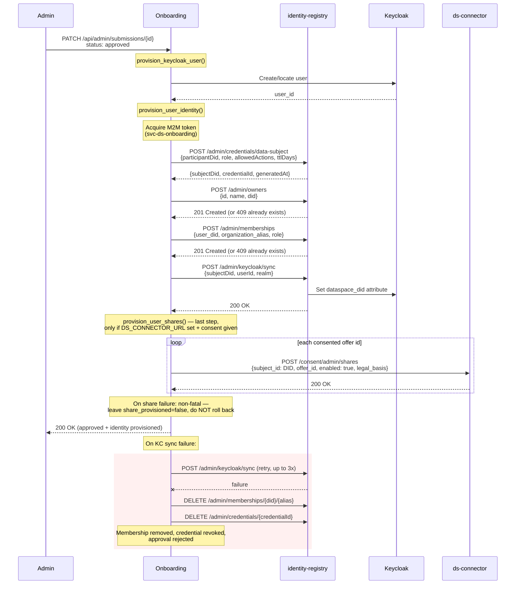

# Dataspace Identity Integration

## Overview

When a user completes onboarding and `DATASPACE_VC_ENABLED` is `true`, the system provisions a dataspace identity for the approved user. This includes:

- A **DID** (Decentralized Identifier) for the user as a data subject
- A **Verifiable Credential** (VC) binding the user to a participant organization
- An **organization membership** registering the DID as a member of the REC in the identity-registry
- A **Keycloak `dataspace_did` attribute** linking the user's login identity to their DID
- **Data-sharing shares** provisioned to the dataspace connector for the offers the user consented to during onboarding (optional; runs last and is non-fatal)

The membership matters as much as the credential: ds consent endpoints (`/consent/my/shares`) check membership before allowing a data subject to manage sharing preferences. A user with a VC but no membership holds a valid identity that cannot do anything.

Identity provisioning is triggered when an admin changes a submission's status to `approved`. The onboarding service communicates with the **identity-registry** HTTP API using machine-to-machine (M2M) authentication. If provisioning fails, the approval is rejected -- no partial state is left behind.

Onboarding stores only the subject ID, DID, credential ID, and issuance timestamp. The credential itself lives in the identity-registry's credential store.

## Flow

When a submission is approved and `DATASPACE_VC_ENABLED` is true:

1. `provision_keycloak_user()` creates or locates the Keycloak user and returns the `user_id`.
2. `provision_user_identity()` calls the identity-registry to issue a credential and sync the DID to Keycloak, then provisions any data-sharing shares to the connector as its last step.

### Step-by-step

1. **Keycloak user provisioning** -- `provision_keycloak_user()` creates the user in Keycloak (or finds an existing one) and returns the `user_id`. This runs before identity provisioning so the user ID is available for the sync step.

2. **Credential issuance** -- `POST /admin/credentials/data-subject` sends the participant DID, role, allowed actions, and TTL to the identity-registry. The registry generates a DID for the user, issues a Verifiable Credential, and returns `{subjectDid, credentialId, generatedAt}`.

3. **Organization ensure** -- `POST /admin/owners` creates the REC organization if it does not exist yet. A `409 Conflict` means it is already registered and is treated as success, so the call is safe to repeat on every approval. Set `DATASPACE_ORGANIZATION_AUTO_CREATE=false` if the organization is provisioned out-of-band and onboarding should not attempt to create it.

4. **Membership registration** -- `POST /admin/memberships` registers the user's DID as a member of the REC organization with `DATASPACE_MEMBERSHIP_ROLE`. A `409 Conflict` is treated as success. Without this step the user cannot use the ds consent endpoints, which gate on `GET /memberships/check`.

5. **Keycloak DID sync** -- `POST /admin/keycloak/sync` tells the identity-registry to push the `dataspace_did` attribute onto the Keycloak user. This links the user's login identity to their dataspace DID.

6. **Rollback on failure** -- If the Keycloak sync fails after 3 retries, the membership is removed via `DELETE /admin/memberships/{did}/{alias}`, the credential is revoked via `DELETE /admin/credentials/{credentialId}`, and the approval is rejected. This prevents orphaned credentials and memberships that have no corresponding Keycloak mapping.

7. **Data-sharing share provisioning** -- `provision_user_shares()` runs as the last step, after the Keycloak DID sync. When `DS_CONNECTOR_URL` is set and the submission's `data_sharing_consent` is true, it POSTs once per recorded offer id to `{DS_CONNECTOR_URL}/consent/admin/shares` with body `{subject_id: <dataspace DID>, offer_id, enabled: true, legal_basis: {source: "onboarding", rec_slug, consent_text_version, locale, rendered_text_sha256, accepted_at, submission_ref}}`. It names an offer, never a dataset. The call is idempotent and sets `share_provisioned=true` on success. Unlike step 6, it is **deliberately non-fatal**: a failed share never rolls back the identity or rejects the approval -- it leaves `share_provisioned=false` for retry. Onboarding authenticates with its `svc-ds-onboarding` service token (scope `connector.consent.provision`, audience `svc-ds-connector`).

Steps 3 and 4 are skipped entirely when `DATASPACE_ORGANIZATION_ALIAS` is unset, which keeps existing deployments working unchanged. Step 7 is skipped when `DS_CONNECTOR_URL` is unset.

### Retrying a failed share

`POST /api/admin/submissions/{id}/retry-share` re-runs `provision_user_shares()` with `raise_on_error=True`, returning `422` if the connector rejects the request. Use it to complete provisioning for a submission left at `share_provisioned=false`.

## Authentication

The onboarding service authenticates to identity-registry using **M2M (machine-to-machine) client credentials**:

- **Client**: `svc-ds-onboarding` (configurable via `DS_ONBOARDING_CLIENT_ID`)
- **Auth provider**: `celine.sdk.auth.OidcClientCredentialsProvider` from `celine-sdk>=1.13.0`
- **Token handling**: The provider acquires tokens via the OIDC client credentials flow, caches them in memory, and auto-refreshes before expiry. No manual token management is needed.

The `httpx.AsyncClient` is configured with the auth provider, so all outgoing requests to identity-registry automatically include a valid Bearer token. The same `svc-ds-onboarding` service token is used for the connector share-provisioning calls, carrying the `connector.consent.provision` scope and `svc-ds-connector` audience.

## Configuration

### Identity provisioning settings

| Variable | Default | Description |
|---|---|---|
| `DATASPACE_VC_ENABLED` | `false` | Master toggle. When `false`, all dataspace identity provisioning is skipped. |
| `IDENTITY_REGISTRY_URL` | *(none)* | Base URL of the identity-registry service (e.g. `http://identity-registry:8000`). Required when `DATASPACE_VC_ENABLED=true`. |
| `OIDC_BASE_URL` | *(none)* | OIDC issuer URL for M2M token acquisition (e.g. `http://keycloak:8080/realms/dataspace`). Required when `DATASPACE_VC_ENABLED=true`. |
| `DS_ONBOARDING_CLIENT_ID` | `svc-ds-onboarding` | Keycloak client ID for M2M authentication. |
| `DS_ONBOARDING_CLIENT_SECRET` | *(none)* | Keycloak client secret for M2M authentication. Required when `DATASPACE_VC_ENABLED=true`. |

### Dataspace policy settings

These settings control what goes into the issued credential:

| Variable | Default | Description |
|---|---|---|
| `DATASPACE_LINKED_PARTICIPANT_DID` | *(none)* | DID of the participant organization the user is linked to (e.g. `did:web:participant.example.com`). |
| `DATASPACE_USER_ROLE` | *(none)* | Role assigned in the credential (e.g. `member`). |
| `DATASPACE_ALLOWED_ACTIONS` | *(none)* | Comma-separated actions the user is authorized for. |
| `DATASPACE_VC_TTL_DAYS` | *(none)* | Credential validity period in days. |
| `DATASPACE_SUBJECT_SOURCE` | `email_hash` | How the subject identifier is derived. `email_hash` hashes the login email to produce a stable ID without placing raw email in DID paths. |

### Organization membership settings

| Variable | Default | Description |
|---|---|---|
| `DATASPACE_ORGANIZATION_ALIAS` | *(none)* | Alias (owner `id`) of the REC organization in the identity-registry. Must match `^[a-z0-9][a-z0-9-]*[a-z0-9]$`. When unset, organization and membership registration are skipped. |
| `DATASPACE_ORGANIZATION_NAME` | *(alias)* | Display name used when creating the organization. Defaults to the alias. |
| `DATASPACE_ORGANIZATION_DID` | *(none)* | Optional DID for the organization record (e.g. `did:web:rec.example.com`). |
| `DATASPACE_ORGANIZATION_AUTO_CREATE` | `true` | When `true`, onboarding ensures the organization exists via `POST /admin/owners` before registering the membership. Set `false` if the organization is managed out-of-band. |
| `DATASPACE_MEMBERSHIP_ROLE` | `member` | Role recorded on the membership. |

### Data-sharing share settings

These control provisioning of data-sharing consent to the dataspace connector (step 7).

| Variable | Default | Description |
|---|---|---|
| `DS_CONNECTOR_URL` | *(none)* | Connector base URL for provisioning standing consent (`POST /consent/admin/shares`). When unset, share provisioning is skipped. |
| `DS_NS_URL` | *(none)* | Public vocabulary base (`GET /ns/sharing-offers`) the wizard renders offers from. When unset, falls back to the connector's `/ns` path. |

## Error Handling

The integration follows a **fail-closed** strategy:

- If `DATASPACE_VC_ENABLED` is `true` and identity provisioning fails, the submission status change to `approved` is rejected. The admin sees an error and can retry.
- **Credential revocation on sync failure**: If the credential is issued successfully but the Keycloak sync fails after 3 retries, the membership is deleted and the credential is revoked via `DELETE /admin/credentials/{credentialId}`. This ensures there are no orphaned credentials or memberships without a corresponding Keycloak DID mapping.
- **Idempotent organization and membership calls**: `409 Conflict` from `POST /admin/owners` and `POST /admin/memberships` is treated as success, so re-approving or retrying a failed approval does not error out. Any other 4xx/5xx aborts the approval.
- **No partial state**: Either the full provisioning succeeds (credential + organization + membership + KC sync) or nothing is committed. The submission remains in its previous status.
- **Share provisioning is non-fatal**: Data-sharing share provisioning (step 7) runs after the identity is committed and is exempt from fail-closed. A connector rejection or error leaves `share_provisioned=false` and logs, but never rolls back the identity or the approval. Operators retry via `POST /api/admin/submissions/{id}/retry-share` (which surfaces connector rejections as `422`).

## Dependencies

- `celine-sdk>=1.13.0` -- provides `celine.sdk.auth.OidcClientCredentialsProvider` for M2M token management
- `httpx` -- async HTTP client for identity-registry API calls
- **identity-registry** service -- must be deployed and accessible at `IDENTITY_REGISTRY_URL`
- **ds-connector** service -- required only for data-sharing share provisioning; must be accessible at `DS_CONNECTOR_URL`
- **Keycloak** -- must have the `svc-ds-onboarding` client configured with appropriate permissions, including the `connector.consent.provision` scope and `svc-ds-connector` audience for share provisioning
