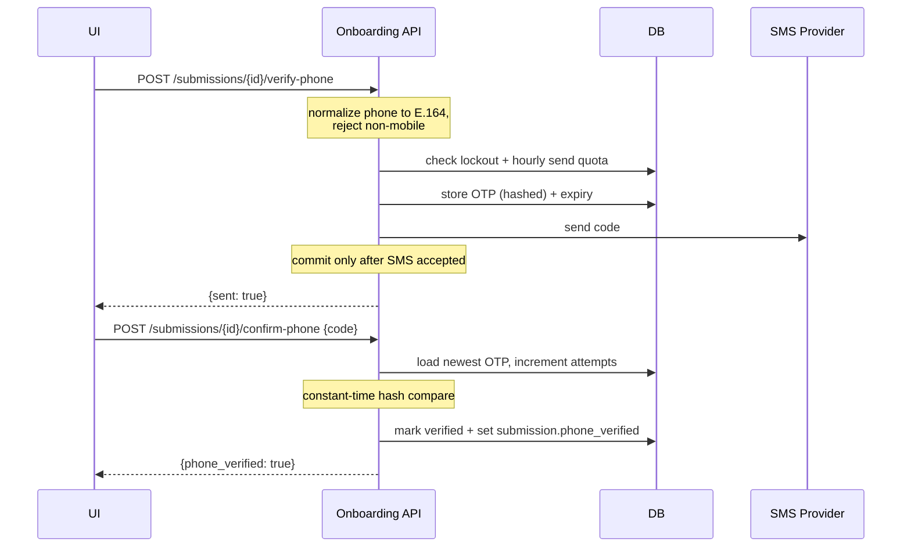

# Phone Verification (SMS OTP)

## Overview

The platform can verify a participant's phone number by sending a one-time
passcode (OTP) via SMS. This raises the identity assurance of a submission: the
person controls the phone number they registered, which — combined with fiscal
code checksum, POD validation, and bill extraction — provides *reasonable
assurance* for REC membership and energy-data-sharing consent.

Verification is **optional** and only active when a REC's manifest includes the
`phone_verify` step (see [Wizard integration](#wizard-integration)).

## Flow



## Endpoints

Both endpoints are session-gated (`X-Session-Token`, 10-minute TTL) and
rate-limited per IP, exactly like the other public submission endpoints.

| Method | Path | Body | Notes |
|---|---|---|---|
| `POST` | `/api/{rec}/submissions/{id}/verify-phone` | `{phone?}` | Sends an OTP. `phone` defaults to the number on the submission. 10/hr per IP. |
| `POST` | `/api/{rec}/submissions/{id}/confirm-phone` | `{phone?, code}` | Verifies the code, marks the submission verified. 20/hr per IP. |

`verify-phone` returns `{phone_verified: false, sent: true}`.
`confirm-phone` returns `{phone_verified: true, sent: false, phone_verified_at}`.

### Status codes

| Code | Meaning |
|---|---|
| `422` | Phone number is not a valid mobile number (SMS undeliverable) |
| `429` | Hourly send quota reached, or phone locked after too many wrong codes |
| `410` | Code expired (session or OTP TTL) |
| `400` | Wrong code (message includes remaining attempts) or code already used |
| `502` | SMS provider failed — no OTP row is persisted, so the quota is untouched |

## Security model

- **Codes are never stored.** Only an HMAC-SHA256 of `phone:code` (keyed by
  `ENCRYPTION_KEY`) is persisted, so a database dump does not reveal codes.
  The hash is bound to the phone number, so it cannot be replayed for a
  different number.
- **Phone numbers are encrypted at rest** (`EncryptedString`) and additionally
  stored as a deterministic `phone_hash` used only for rate-limit and lockout
  lookups — the number is never in the clear as a lookup key.
- **Max 3 attempts per code**, then the phone is locked for 1 hour. Once
  attempts are exhausted, even the correct code is rejected — requesting a new
  code during lockout is also refused, so lockout cannot be bypassed.
- **Max 3 sends per phone per hour**, counted over a rolling window.
- **Codes expire after 10 minutes.**
- **The attempt counter is committed even when verification fails**, so a
  disconnect mid-verify cannot be used to retry for free.
- All thresholds are configurable (see [Configuration](#configuration)).

## Phone normalization

Numbers are normalized to E.164 using the `phonenumbers` library, defaulting to
the Italian region. `"333 1234567"`, `"+39 333 1234567"` and `"3331234567"` all
resolve to `+393331234567`, so rate limits and lockouts cannot be bypassed by
reformatting. Landlines are rejected up front because SMS to them silently
fails.

## Configuration

| Variable | Default | Description |
|---|---|---|
| `SMS_PROVIDER` | `log` | `log` (dev — prints the OTP) or `brevo` |
| `BREVO_API_KEY` | *(none)* | Brevo API key. Required for `brevo`. |
| `BREVO_SMS_SENDER` | *(none)* | Alphanumeric sender id (≤11 chars) or E.164. Required for `brevo`. |
| `SMS_OTP_TEMPLATE` | `Il tuo codice di verifica e' {code}` | Message body. Must contain `{code}`. |
| `DPA_SMS_SIGNED` | `false` | Must be `yes` for any non-`log` provider — the app refuses to start otherwise (GDPR Art. 28). |
| `OTP_CODE_LENGTH` | `6` | Number of digits. |
| `OTP_TTL_SECONDS` | `600` | Code validity window. |
| `OTP_MAX_ATTEMPTS` | `3` | Wrong guesses before lockout. |
| `OTP_MAX_SENDS_PER_HOUR` | `3` | Per phone number. |
| `OTP_LOCKOUT_SECONDS` | `3600` | Lockout duration after attempts are exhausted. |

## GDPR

Sending a phone number to an SMS gateway makes that gateway a data processor
under GDPR Art. 28, exactly like the LLM extraction provider. The app enforces a
signed DPA via `DPA_SMS_SIGNED=yes` before it will start with a real provider.
The legal basis for the processing is legitimate interest (Art. 6(1)(f)) —
identity verification for REC enrolment — and must be documented in the REC's
privacy policy template.

## Provider extension

To add a provider, implement the `SmsProvider` protocol in
`services/sms.py`:

```python
class SmsProvider(Protocol):
    async def send_otp(self, phone: str, code: str) -> bool: ...
```

and register it in `get_provider()`. The OTP service depends only on the
protocol, so nothing else changes.

## Approval gating

When a REC manifest's `steps` includes `phone_verify`, a submission cannot
transition to `APPROVED` unless `phone_verified=true` — the attempt raises
`Cannot approve: phone number is not verified`. RECs that do not list the step
are unaffected: approval behaves exactly as before, and the verification
endpoints remain callable but optional. This gate is enforced in
`submission_service._assert_phone_verified`.

## Wizard integration

Add `phone_verify` to a REC manifest's `steps` (between `personal` and
`energy`) to activate the gate above.

> **Not yet implemented:** the SvelteKit wizard step for `phone_verify`
> (Block 2.6) and the GDPR privacy-policy template text for phone verification
> (Block 2.8). The backend endpoints, gating, and DPA guard are in place; the
> UI currently has no dedicated screen for entering the OTP.
